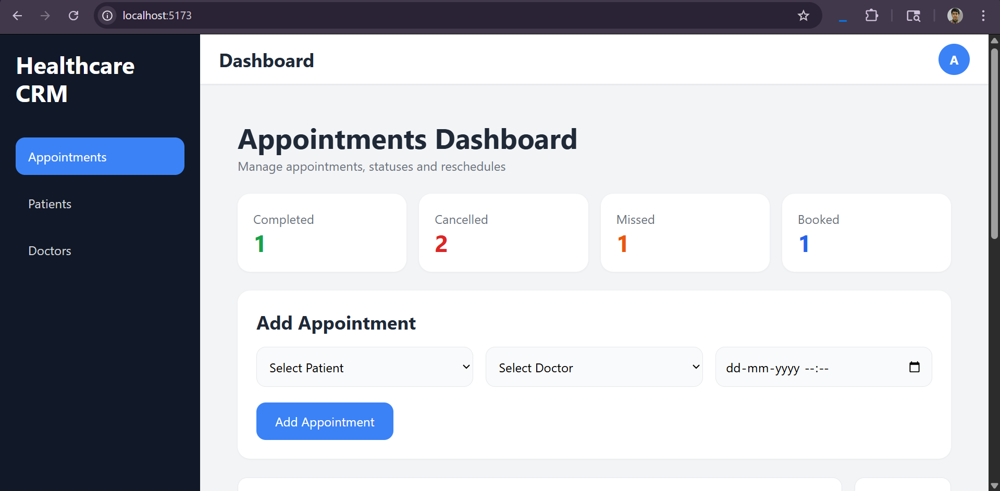
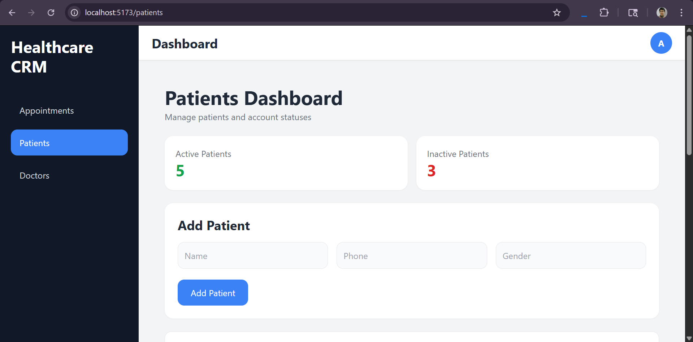
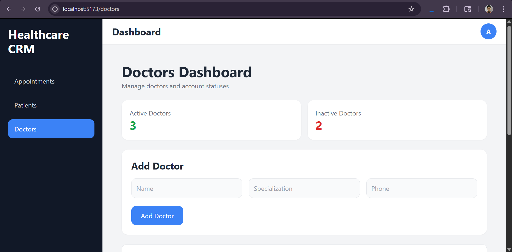
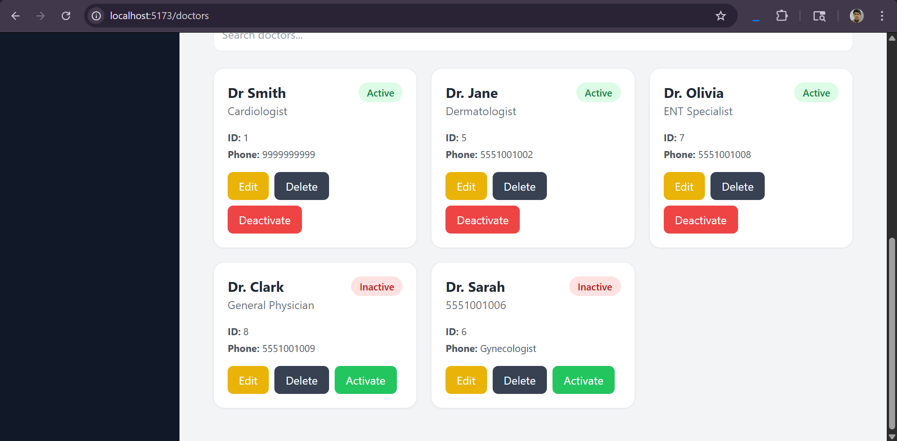
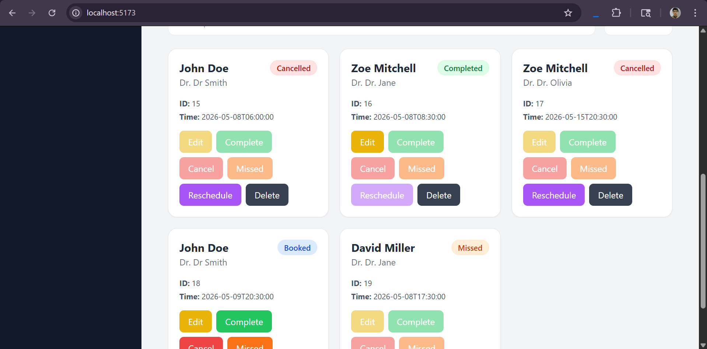

# Healthcare CRM

A full-stack Healthcare CRM system built using Spring Boot, React, Tailwind CSS, and MySQL.

The system manages patients, doctors, and appointments with advanced appointment lifecycle handling, status-based restrictions, soft delete functionality, and rescheduling workflows.

---

## Features

### Patient Management

* Add, edit, deactivate, and delete patients
* Soft delete using active/inactive state

### Doctor Management

* Add, edit, deactivate, and delete doctors
* Prevent appointments for inactive doctors

### Appointment Management

* Create appointments
* Status lifecycle:

  * BOOKED
  * COMPLETED
  * CANCELLED
  * MISSED
  * RESCHEDULED
* Case-insensitive status updates
* Rescheduling creates a NEW appointment record
* Status-based action restrictions

### Business Rules

* Inactive doctors/patients cannot receive appointments
* Deactivating doctor/patient automatically cancels appointments
* MISSED appointments are locked from editing

### Frontend

* Responsive SaaS-style dashboard
* Search and filtering
* React Router navigation
* Tailwind UI

---

## Tech Stack

### Backend

* Java
* Spring Boot
* Spring Data JPA
* Hibernate

### Frontend

* React
* Tailwind CSS
* Axios
* React Router

### Database

* MySQL

---

## Project Structure

```txt
backend/
frontend/
database/
screenshots/
docs/
```

---

## Screenshots











---

## Installation

### Backend

```bash
cd backend
mvn spring-boot:run
```

### Frontend

```bash
cd frontend
npm install
npm run dev
```

### Database

Import:

```txt
database/healthcare_crm.sql
```

---

## Future Improvements

* Role-based authentication
* JWT security
* Multi-user support
* Email notifications
* Analytics dashboard
* Docker deployment

---

## License

MIT License
